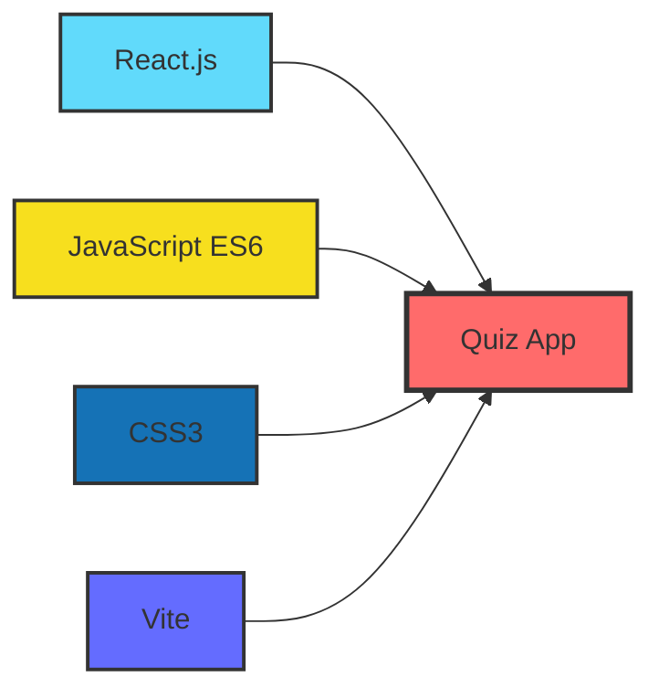
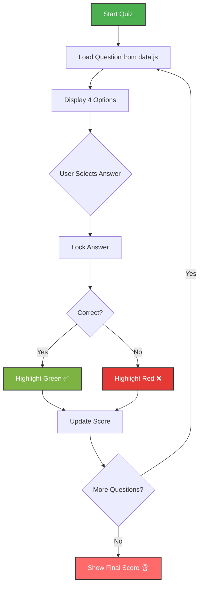

<div align="center">

# 🧠 Quiz App (React)


<p align="center">
  
  
  
</p>

### A simple and interactive **Quiz Application** built using **React**

*Users can attempt multiple-choice questions, get instant feedback on answers, and view their final score at the end.*

</div>

---

## 🌟 Features

<div align="center">

| Feature | Description |
|---------|-------------|
| 📋 **Multiple Choice** | Engaging multiple-choice questions |
| ✅ **Instant Feedback** | Real-time correct/wrong answer highlighting |
| 🔒 **Answer Locking** | Prevents multiple clicks per question |
| ➡️ **Easy Navigation** | Smooth next question transition |
| 🧮 **Score Tracking** | Live score updates throughout quiz |
| 🏁 **Result Display** | Comprehensive final score screen |
| 🎨 **Modern UI** | Clean and responsive design |

</div>

---

## 🛠️ Tech Stack

<div align="center">



</div>

<div align="center">

| Technology | Purpose |
|------------|---------|
| ⚛️ **React.js** | UI Component Framework |
| 📜 **JavaScript (ES6)** | Core Programming Language |
| 🎨 **CSS** | Styling & Layout |
| ⚡ **Vite** | Build Tool & Dev Server |

</div>

---

## 📂 Project Structure

```
QuizApp/
│
├── 📁 src/
│   ├── 📁 components/
│   │   └── 📁 Quiz/
│   │       ├── 📄 Quiz.jsx        # Main quiz component
│   │       └── 🎨 Quiz.css        # Component styling
│   │
│   ├── 📁 assets/
│   │   └── 📄 data.js             # Quiz questions data
│   │
│   ├── 📄 App.jsx                 # Root component
│   └── 📄 main.jsx                # Entry point
│
├── 📁 public/                      # Static assets
├── 📄 index.html                   # HTML template
├── 📄 package.json                 # Dependencies
└── 📖 README.md                    # Documentation
```

## 📊 How It Works

<div align="center">



</div>

### 🎯 Key Mechanics

- ✨ Questions are loaded from `data.js`
- 🔢 Each question has 4 options
- 🟢 Correct answers are highlighted in **green**
- 🔴 Wrong selections are highlighted in **red**
- 📈 Final score is shown after the last question

---

### State Management

```javascript
const [index, setIndex] = useState(0);
const [question, setQuestion] = useState(data[index]);
const [lock, setLock] = useState(false);
const [score, setScore] = useState(0);
const [result, setResult] = useState(false);
```

---

## 📌 Future Enhancements

<div align="center">

| Priority | Feature | Status |
|----------|---------|--------|
| 🔥 | ⏱️ Timer for each question | 🔜 Planned |
| 🔥 | 🔁 Restart quiz option | 🔜 Planned |
| ⭐ | 📱 Better mobile responsiveness | 🔜 Planned |
| ⭐ | 🎉 Animations and sound effects | 💡 Idea |
| ⭐ | 📊 Question difficulty levels | 💡 Idea |
| ⭐ | 💾 Save progress locally | 💡 Idea |
| ⭐ | 🏅 Leaderboard system | 💡 Idea |

</div>
